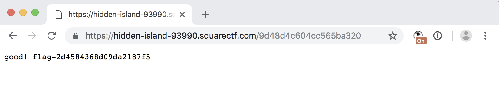

# C10: fixed point

This problem provided an HTML file with a short recursive function f(x) in javascript. For clarity, that javascript function is shown below:

```js
function f(x) {
  if ((x.substr(0, 2) == '🚀') && (x.slice(-2) == '🚀')) {
    return x.slice(2, -2);
  }
  if (x.substr(0, 2) == '👽') {
    return '🚀' + f(x.slice(2));
  }
  if (x.substr(0, 2) == '📡') {
    return f(x.slice(2)).match(/..|/g).reverse().join("");
  }
  if (x.substr(0, 2) == '🌗') {
    return f(x.slice(2)).repeat(5);
  }
  if (x.substr(0, 2) == '🌓') {
    var t = f(x.slice(2));
    return t.substr(0, t.length/2);
  }
  return "";
}
```

## Solution

Given the title of the problem, and the function which called f(x) it was clear that the objective was to construct a string x such that f(x) == x. For the ease of programming, I took this function, and re-wrote it in python and replaced the emojis with normal characters. This came
in useful later when performing an exhaustive search of the possible string states.

```python
def f(x):
	if len(x) == 0:
		return x
	if x[0] == 'A' and x[-1] == 'A':
		return x[1:-1]
	if x[0] == 'B':
		return 'A' + f(x[1:])
	if x[0] == 'C':
		return ''.join(reversed([a for a in f(x[1:])]))
	if x[0] == 'D':
		return f(x[1:]) * 5
	if x[0] == 'E':
		_x = f(x[1:])
		if len(_x)%2 != 0:
			return ''
		return _x[:len(_x)//2]
	return ''
```

After thinking for a while on how to construct a string which would output a non-null string, I noticed that the function only output a string literal in the first case, when a string took the form `A...A`. Furthermore, each other case of the if statement removed the first character, called `f(x[1:])` on the resulting string, and then used that in a further action. This means, that the only way to construct a string which was not empty, was with one which matched the regex `[BCDE]*A.*A`.

With this fact in mind, I set to writing a program which would randomly generate strings with this pattern, and output their own value and resulting string. In this program, I replaced the middle non-modified string with lowercase characters so that they would be easily identifiable in the result. With this program, I weeded out 

```python
for i in range(1000000):
	N = random.randint(1,20)
	val = ''.join([random.choice('BCDE') for j in range(N)]) + 'A' + 'abcdefghijklmnopqrstuvwxyz'[:random.randint(1,25)] + 'A'
	_val = f(val)
	if len(_val) != len(val):
		continue
	if _val == 'A'*len(_val) or _val == 'a'*len(_val):
		continue
	if _val.startswith('A'):
		continue
	print(val,_val[:50])
```

After observing some of the output and interesting results, I came across a string which seemed to fit the right output format. It was:

```
val  CEEDAabcdefghijklmnopqrstuvwxA
_val fedcbaxwvutsrqponmlkjihgfedcba
```

Lining up the two strings, it was then a simple matter of filling in the lowercase characters with A,B,C,D,E so that they match. Doing this resulted in the following string:

```
val  CEEDAAADEECghijklmnopqrsCEEDAA
_val CEEDAAADEECsrqponmlkjihgCEEDAA
```

Since the final strings had undefined lowercase values in the middle, I replaced the remaining lowercase characers with A's and then converted the string back to emojis:

📡🌓🌓🌗🚀🚀🚀🌗🌓🌓📡🚀🚀🚀🚀🚀🚀🚀🚀🚀🚀🚀🚀🚀📡🌓🌓🌗🚀🚀

Sending this to the server resulted in the flag:



## Post-Solution Commentary

While the solution string is rather long, it is more-or-less defined by only the first four characters, after which the remainder of the string can be filled in formulaically.

My initial result turned out to be only one of several classes of solutions. Another solution is: CEDEAAAEDECxCEDEAAAEDECxCEDEAA 📡🌓🌗🌓🚀🚀🚀🌓🌗🌓📡xx📡🌓🌗🌓🚀🚀🚀🌓🌗🌓📡xx📡🌓🌗🌓🚀🚀.

After some analysis, it seems like the each solution likely has two `E` characters (which halve the string), and one `D` character (which multiply the string by 5), and a handful of other `B`s or `C`s. Intuitively this makes some sense, as strings with those characters which expand and constrict the string by approximately the same amount, which would be required to make a string of the same length. Finding an exact solution then seems like an exercise in trial-and-error so that you find the correct initial string of a solution string.

Overall, I was very close to finishing this problem first, being narrowly edged out with the 4th solution, 13 minutes behind the leader.
