# C3: shredded

Link: [https://squarectf.com/2018/shredded.html](https://squarectf.com/2018/shredded.html)

This challenge provided a bunch of images which looked like long strips of black and white blocks. Given the title and the problem description, the objective seemed to be aligning all of the strips to form an image. The images are shown below.


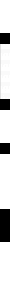
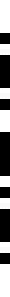
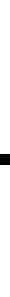
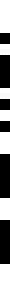
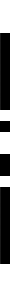
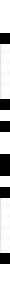
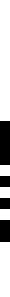
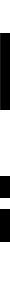

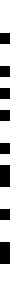


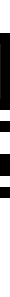
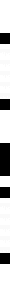
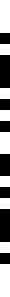

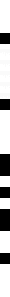

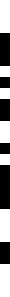
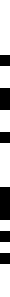
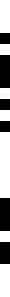
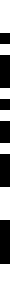
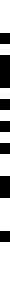
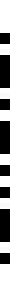
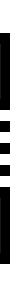

## Solution

After some tinkering with several of the files, it became clear that the strips were meant to be constructed into a QR code. I spent a great deal of manual analysis looking at the strips, attempting to line them up so that the three squares of the QR code were properly created and the QR code "format info" was valid (see the wikipedia page for QR_code for the latter). After a bunch of trial-and-error, I eventually concluded that the there were too many possibilities to attempt all manually so I wrote a script to exhaust what I thought were all the possible combinations. That script is given below and as you can see, it will attempt to create an image, and then decode the QR code within using a python library.

```
from PIL import Image
from pyzbar.pyzbar import decode

images = list(map(Image.open, ['shredded/%d.png'%i for i in range(27)]))
#print(images)
#print(list(images))

widths, heights = zip(*(i.size for i in images))

total_width = sum(widths)
max_height = max(heights)
print(widths, heights)

def output_order(image_order):

	for i in range(27):
		if i not in image_order:
			image_order.append(i)
	print(image_order)
	x_offset = 0
	new_im = Image.new('RGB', (total_width, max_height))
	for i in image_order:
		im = images[i]
		new_im.paste(im, (x_offset,0))
		x_offset += im.size[0]

	#fname = 'out_%s.png'%('.'.join([str(x) for x in image_order]))
	#print(fname)
	#new_im.save(fname)
	print(decode(new_im))

#              * *(25/16)* *  *           (23) x  y  x  y     *.    * z  w w  w  z *
image_order = [5,6,25,16,2,15,26] + [3] + [23,10,21,19,20] + [7] + [8,1,22,4,24,18,14]

output_order(image_order)

for v in range(2):
	for x in range(2):
		for y in range(2):
			for z in range(2):
				for w in range(6):
					image_order = [5,6,25,16,2,15,26] + [3] + [23,10,21,19,20] + [7] + [8,1,22,4,24,18,14]
					if v == 1:
						image_order[2],image_order[3] = 16,25
					if x == 1:
						image_order[9],image_order[11] = 19,10
					if y == 1:
						image_order[10],image_order[12] = 20,21
					if z == 1:
						image_order[15],image_order[19] = 18,1
					if w == 1:
						image_order[16],image_order[17],image_order[18] = 22,24,4
					elif w == 2:
						image_order[16],image_order[17],image_order[18] = 4,22,24
					elif w == 3:
						image_order[16],image_order[17],image_order[18] = 4,24,22
					elif w == 4:
						image_order[16],image_order[17],image_order[18] = 24,4,22
					elif w == 5:
						image_order[16],image_order[17],image_order[18] = 24,22,4
					output_order(image_order)
```

Running this script outputs the decoded value for several combinations (likely due to the QR code error correction), giving the solution. An example of the lined up strips is also shown below.

`[Decoded(data=b'GOOD JOB. FLAG-80AD8BCF79', type='QRCODE', rect=Rect(left=0, top=33, width=210, height=231), polygon=[Point(x=0, y=33), Point(x=0, y=264), Point(x=210, y=264), Point(x=210, y=33)])]`


