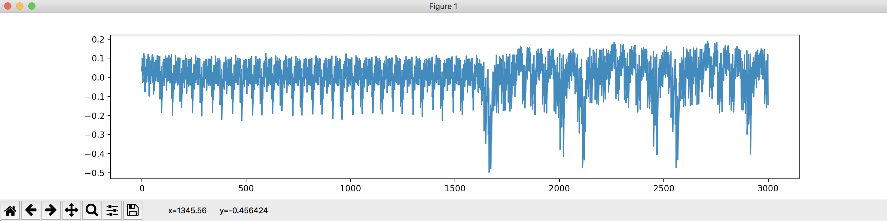
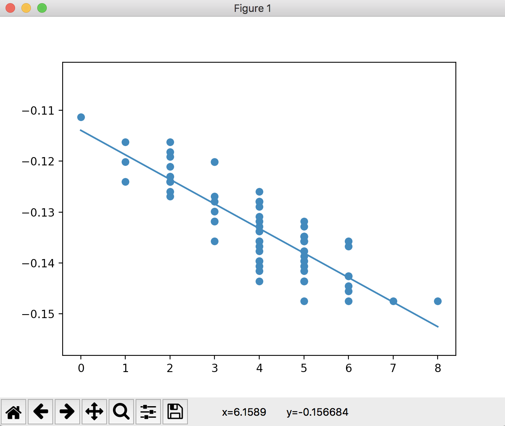

# C4: leaky power

Link: [https://squarectf.com/2018/leaky_power.html](https://squarectf.com/2018/leaky_power.html)

This challenge provided three files consisting of some [power measurement traces](./files/leaky_power/powertraces.npy), some [AES plaintext inputs](./files/leaky_power/plaintexts.npy), and [an encrypted JWE blob](./files/leaky_power/instructions.jwe). Given the challenge text, it was clear that this challenge would involve recovering an AES key using some power analysis side-channel techniques. An example of the first power trace ploted with python's matplotlib is shown below.



## Solution

Coming up with the right solution for this problem was very tricky. First, I tried looking for a simple power analysis attack (SPA). Second, I tried writing a Differential Power Analysis (DPA) attack with the assumption that the best solution would have a linear regression with the largest slope value. This turned out to be incorrect and I couldn't get consistent results for different key bytes.

Finally, I constructed a Correlation Power Analysis attack. This attack attempts to recover each byte of key individually by picking a time value `t`, a key byte `k`, computing the expected AES sbox output `sbox[plain[i]^k]`, and correlating the hamming weight of that output against the power output at time `t`. There are many different references out there on this attack, but one I found useful was [here](https://www.tandfonline.com/doi/full/10.1080/23742917.2016.1231523). To mount this attack I wrote a custom program to perform the attack shown below. Note, that you can turn the plots on/off by setting the `do_plot` variable.

```python
import matplotlib.pyplot as plt
import scipy.stats
import numpy

plaintexts = numpy.load(open('leaky_power/plaintexts.npy','rb'))
powertraces = numpy.load(open('leaky_power/powertraces.npy','rb'))

NPLAIN,NTIME = powertraces.shape

do_plot = True

if do_plot:
	# plot powertrace 0
	plt.plot(powertraces[0])
	plt.show()

sbox = [
    0x63, 0x7C, 0x77, 0x7B, 0xF2, 0x6B, 0x6F, 0xC5, 0x30, 0x01, 0x67, 0x2B, 0xFE, 0xD7, 0xAB, 0x76,
    0xCA, 0x82, 0xC9, 0x7D, 0xFA, 0x59, 0x47, 0xF0, 0xAD, 0xD4, 0xA2, 0xAF, 0x9C, 0xA4, 0x72, 0xC0,
    0xB7, 0xFD, 0x93, 0x26, 0x36, 0x3F, 0xF7, 0xCC, 0x34, 0xA5, 0xE5, 0xF1, 0x71, 0xD8, 0x31, 0x15,
    0x04, 0xC7, 0x23, 0xC3, 0x18, 0x96, 0x05, 0x9A, 0x07, 0x12, 0x80, 0xE2, 0xEB, 0x27, 0xB2, 0x75,
    0x09, 0x83, 0x2C, 0x1A, 0x1B, 0x6E, 0x5A, 0xA0, 0x52, 0x3B, 0xD6, 0xB3, 0x29, 0xE3, 0x2F, 0x84,
    0x53, 0xD1, 0x00, 0xED, 0x20, 0xFC, 0xB1, 0x5B, 0x6A, 0xCB, 0xBE, 0x39, 0x4A, 0x4C, 0x58, 0xCF,
    0xD0, 0xEF, 0xAA, 0xFB, 0x43, 0x4D, 0x33, 0x85, 0x45, 0xF9, 0x02, 0x7F, 0x50, 0x3C, 0x9F, 0xA8,
    0x51, 0xA3, 0x40, 0x8F, 0x92, 0x9D, 0x38, 0xF5, 0xBC, 0xB6, 0xDA, 0x21, 0x10, 0xFF, 0xF3, 0xD2,
    0xCD, 0x0C, 0x13, 0xEC, 0x5F, 0x97, 0x44, 0x17, 0xC4, 0xA7, 0x7E, 0x3D, 0x64, 0x5D, 0x19, 0x73,
    0x60, 0x81, 0x4F, 0xDC, 0x22, 0x2A, 0x90, 0x88, 0x46, 0xEE, 0xB8, 0x14, 0xDE, 0x5E, 0x0B, 0xDB,
    0xE0, 0x32, 0x3A, 0x0A, 0x49, 0x06, 0x24, 0x5C, 0xC2, 0xD3, 0xAC, 0x62, 0x91, 0x95, 0xE4, 0x79,
    0xE7, 0xC8, 0x37, 0x6D, 0x8D, 0xD5, 0x4E, 0xA9, 0x6C, 0x56, 0xF4, 0xEA, 0x65, 0x7A, 0xAE, 0x08,
    0xBA, 0x78, 0x25, 0x2E, 0x1C, 0xA6, 0xB4, 0xC6, 0xE8, 0xDD, 0x74, 0x1F, 0x4B, 0xBD, 0x8B, 0x8A,
    0x70, 0x3E, 0xB5, 0x66, 0x48, 0x03, 0xF6, 0x0E, 0x61, 0x35, 0x57, 0xB9, 0x86, 0xC1, 0x1D, 0x9E,
    0xE1, 0xF8, 0x98, 0x11, 0x69, 0xD9, 0x8E, 0x94, 0x9B, 0x1E, 0x87, 0xE9, 0xCE, 0x55, 0x28, 0xDF,
    0x8C, 0xA1, 0x89, 0x0D, 0xBF, 0xE6, 0x42, 0x68, 0x41, 0x99, 0x2D, 0x0F, 0xB0, 0x54, 0xBB, 0x16
    ]

def hamming(x):
	arr = [0,1,1,2,1,2,2,3,1,2,2,3,2,3,3,4]
	return arr[x&0xf]+arr[(x>>4)&0xf]

def solve_byte(index):

	max_r_value = 0
	k_solution = None
	t_solution = None

	#for t in range(NTIME):
	for t in range(80+100*index,200+100*index):
		for k in range(256):
			weights = [hamming(sbox[plaintexts[_i][index]^k]) for _i in range(NPLAIN)]
			powers = [powertraces[_i][t] for _i in range(NPLAIN)]
			slope, intercept, r_value, p_value, std_err = scipy.stats.linregress(weights,powers)
			r_squared = r_value**2
			if r_squared > max_r_value:
				max_r_value = r_squared
				k_solution = k
				t_solution = t
				print('t=%d'%t, 'k[%d]=0x%02x'%(index,k), 'r=%f'%r_value, 'r**2=%f'%r_squared)

	print()
	if do_plot:
		# plot the best linear regression
		weights = [hamming(sbox[plaintexts[_i][index]^k_solution]) for _i in range(NPLAIN)]
		powers = [powertraces[_i][t_solution] for _i in range(NPLAIN)]
		slope, intercept, r_value, p_value, std_err = scipy.stats.linregress(weights,powers)
		plt.scatter(weights,powers)
		plt.plot(list(slope*i+intercept for i in range(0,9)))
		plt.show()

	return k_solution

key_arr = [solve_byte(i) for i in range(16)]

print('key array:', key_arr)
print('AES key:', '%02x'*16 % tuple(key_arr))
```

As it turns out, the hamming weight of the correct result is inversely proportional to the power measurement as can be seen in the graph below.



Running the program above to completion gives the resulting AES key as seen below.

```
$ ./leaky_power_solve.py 
t=80 k[0]=0x00 r=-0.062425 r**2=0.003897
t=80 k[0]=0x01 r=0.071487 r**2=0.005110
t=80 k[0]=0x03 r=-0.133160 r**2=0.017732
t=80 k[0]=0x04 r=-0.196700 r**2=0.038691
t=80 k[0]=0x0c r=-0.239661 r**2=0.057438
t=80 k[0]=0x23 r=-0.253977 r**2=0.064504
t=80 k[0]=0x36 r=0.254330 r**2=0.064684
t=80 k[0]=0x39 r=-0.291593 r**2=0.085027
t=80 k[0]=0x96 r=-0.303535 r**2=0.092133
t=81 k[0]=0x78 r=0.316073 r**2=0.099902
t=82 k[0]=0x96 r=-0.321012 r**2=0.103049
t=82 k[0]=0xcc r=0.349120 r**2=0.121885
t=83 k[0]=0x56 r=-0.392435 r**2=0.154005
t=103 k[0]=0x62 r=-0.428024 r**2=0.183205
t=104 k[0]=0x62 r=-0.441120 r**2=0.194586
t=105 k[0]=0x62 r=-0.448065 r**2=0.200762
t=113 k[0]=0xd2 r=0.536461 r**2=0.287790
t=113 k[0]=0xd3 r=0.542491 r**2=0.294297
t=114 k[0]=0xd2 r=0.616825 r**2=0.380473
t=114 k[0]=0xd3 r=0.623537 r**2=0.388799
t=143 k[0]=0xd2 r=-0.726228 r**2=0.527408
t=144 k[0]=0xd2 r=-0.751732 r**2=0.565101
t=147 k[0]=0xd2 r=-0.817109 r**2=0.667668
t=148 k[0]=0xd2 r=-0.864475 r**2=0.747318

...
t=1586 k[15]=0xb2 r=-0.612246 r**2=0.374845
t=1587 k[15]=0xb2 r=-0.779230 r**2=0.607199
t=1588 k[15]=0xb2 r=-0.854737 r**2=0.730576

key array: [210, 222, 160, 87, 209, 20, 95, 69, 103, 150, 150, 96, 36, 167, 3, 178]
AES key: d2dea057d1145f456796966024a703b2
```

The final part of the solution involves using the recovered AES key to decrypt the provided `instructions.jwe` file. This turned out to be VERY difficult as my language of choice is python and I couldn't find a decryption library for this format after hours of searching. After reading the slack channel for the competition, I turned to the `go-jose` library for golang and was able to write a short program to decrypt the result (shown below). At some point, I'd like to go back to figure out why I couldn't get python to work, but alas I had a solution

```go
package main

import (
	"gopkg.in/square/go-jose.v1" // go get gopkg.in/square/go-jose.v1
	"fmt"
	"io/ioutil"
)

func main() {

	sharedKey := []byte{0xd2,0xde,0xa0,0x57,0xd1,0x14,0x5f,0x45,0x67,0x96,0x96,0x60,0x24,0xa7,0x03,0xb2}
	//fmt.Printf("sharedKey: %v\n", sharedKey)

	//enc, _ := ioutil.ReadFile("leaky_power/instructions_corrected.jwe")
	enc, _ := ioutil.ReadFile("leaky_power/instructions.jwe")
	jwe, _ := jose.ParseEncrypted(string(enc))
	//fmt.Printf("jwe: %v\n", jwe)

	dec, _ := jwe.Decrypt(sharedKey)
	fmt.Printf("Decrypt:\n%s\n", dec)
}
```

Running the program gave the flag:

```
$ go run leaky_power_solve.go 
Decrypt:
CONFIDENTIAL

To disable C4, you will need:
- 6 bits of Dragon Sumac
- 1 nibble of Winter Spice
- 1 byte of Drake Cardamom
- 1 flag with value flag-e2f27bac480a7857de45
- 2 diskfulls of Tundra Chives
- 5 forks

Grind the Dragon Sumac in a cup, making sure you don't break the cup as it's probably a delicate cup. Add a sprinkle of
liquid ice to turn it into a cream-like paste, then add the Winter Spice, first almost everything, then the last tiny
remnants.

Fill a pan with elemental water, add the mixture and cool it down with how cool you are, then bring the mixture
to a boil. Let it cool down to the body temperature of a reptile before adding the Drake Cardamom and Tundra Chives,
all at once of one, then half at a time of the other.

Bring everything back to a boil, turn of the heat, mix with the forks and let everything cool down. If you
touch the liquid and it burns you, it hasn't cooled down enough.

Whisk the mixture heavily to aerate it. Stop when it's frothy.

Drinking the potion will disable C4.

note: A small, but very cold amount is needed for the potion to be effective. Mixing it in a milkshake could work, but
be wary of brain freeze.

```