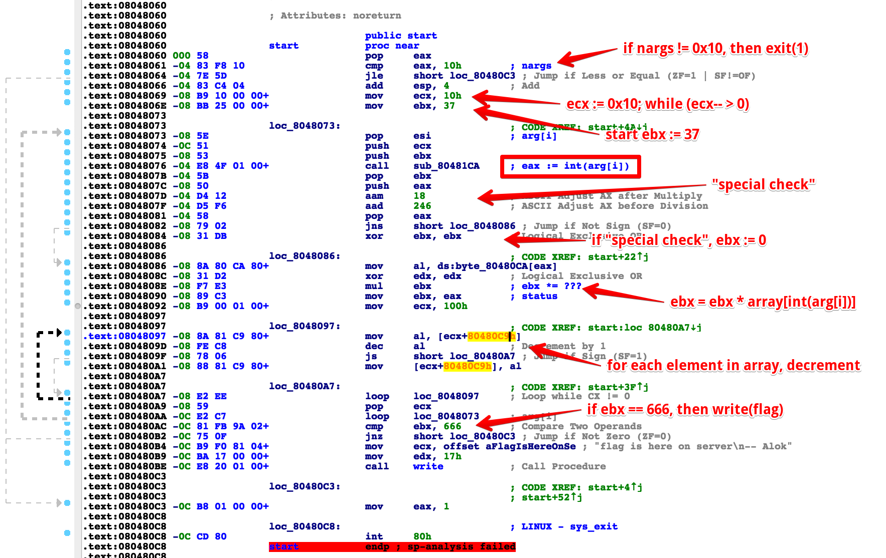
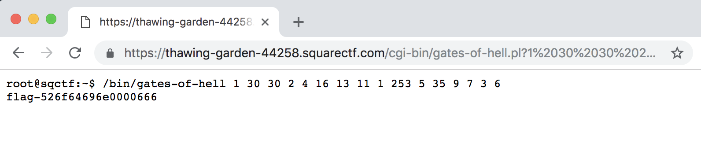

# C6: gates of hell

This challenge provided [an x86 executable](./files/gates-of-hell), and a [challenge page](https://thawing-garden-44258.squarectf.com/cgi-bin/gates-of-hell.pl) which hosted that executable.

## Solution

To start this challenge, I pulled up IDAPro and started looking at the executable's disassembly. My marked up disassembly is shown below.



After looking at the disassembly I came up with rough pseudocode in my head of:

```
assert len(arg) == 16
ebx = 37
initialize array (in executable)
for i in 1..16:
	ebx *= array[int(arg[i])]
	for j in 0..255:
		if array[j] > 0: array[j]--
if ebx == 666:
	output flag
```

Using this pseudocode it was easy enough to pick indicies in the array equivalent to their position, and plug those in as arguments to verify that this pseudocode is accurate. If this was correct, then each array[arg[i]] chosen would be equal to 1 and the resulting ebx would be 37. Unfortunately, this did not work out with my initial array and I realized that I had skipped over the two "special" instructions I marked in the disassembly. Adding those, we have:


```
assert len(arg) == 16
ebx = 37
initialize array (in executable)
for i in 1..16:
	if signed { eax := int(arg[i]); aam 18; aad 246 }: ebx := 0
	ebx *= array[int(arg[i])]
	for j in 0..255:
		if array[j] > 0: array[j]--
if ebx == 666:
	output flag
```

With this in mind, I looked up the [AAM instruction](https://www.felixcloutier.com/x86/AAM.html) and [AAD instruction](https://www.felixcloutier.com/x86/AAD.html) and created some pseudocode for them:

```
aam 18:
	AH := tempAL / 18
	AL := tempAL % 18
	SF set according to AL
aad 246:
	AL := (tempAL + tempAH * 246) & 0xff
	AH := 0
	SF set according to AL
```

Writing a short python script showed that the only indicies for which these two instructions did not result in the sign flag being set were in the ranges 0-17, 28-35, 234-235, and 252-255. With this in mind, I picked new arguments only in these ranges which would result in 37 being output. Finally, with all of these arguments correct, I tweaked two of them so that the multiplied value would be 9 and 2 (in order to give 37*9*2=666), and managed to output the flag on my own machine.

```
$ ./gates-of-hell 1 30 30 2 4 16 13 11 1 253 5 35 9 7 3 6
flag is here on server
```

Finally, to get the flag from the server I returned to the webpage and appended a `?1 30 30 ...` to obtain the flag as shown below.


