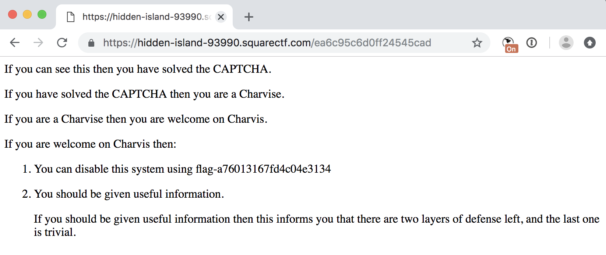

# C8: captcha

This challenge provided a single webpage which expected you to solve an equation and input a solution. A sample HTML page response for the challenge is [linked here](./files/captcha_sample.html).

I should also note, that this page seemed to re-generate about every five seconds so manually attempting to punch in the equation into a calculator was infeasible.

## Solution

Looking at the HTML response, the first thing that jumps out is that the equation text is actually represented as an alphabetic equation where each symbols is replaced by a letter. For example in the page linked above, the equation is below (where `m` -> `(`, `D` -> `6`, `Q` -> `*`, etc).

`mmmmD Q mmms n DB Q dB n mu n uaBBB n mmmi n uB Q mmmD Q KB Q sB Q GBB y ms y DBBB n mmmK Q iB y mmt n GB y mD y mmD Q tB Q ms Q md Q RBBBBBB Q mmmmmi n mG y sBB n mD y tBB y DB n tB Q mmG y iB n uaBBBB y mmK Q mmG Q iB n mmd n RB y mmG y sB n mmmu n sB n tB Q KBBBBB n ms Q mmt y mR Q uBB n DBBBB`

Unfortunately, this mapping changes with every new page (about every five seconds) so coming up with a fixed pattern won't work.

With this knowledge, I dove into parsing the base64-encoded TTF data just before this string. You can read through the (very ugly) parsing code below to see exactly how this was done. But the basic gist was to:

1. Convert the TTF to an XML file
2. Pull out the CMAP section to parse out the characters
3. Pull out the GLYF section to parse out the glyph pixel mappings and use those along with a lookup table to find the real character (integer, parenthesis, or operation).
4. Eval the solution, and in a separate browser window quickly copy/paste my solution.

CAUTION! This script uses `eval()` and is highly unsafe if you do not trust your input. Use at your own risk!

```python
pat_font = re.compile('base64,([A-Za-z0-9/+=]+)\'')
pat = re.compile('<p>([\w ]+)</p>',re.IGNORECASE)

r = requests.get('https://hidden-island-93990.squarectf.com/ea6c95c6d0ff24545cad')

font_match = re.search(pat_font,r.text)
print(font_match[1])
f = open('tmp.ttf','wb')
f.write(base64.b64decode(font_match[1]))
f.close()

from fontTools.ttLib import TTFont
font = TTFont('tmp.ttf')
print(font)
font.saveXML('tmp.xml')

import xml.etree.ElementTree as ET
tree = ET.parse('tmp.xml')
#print(tree.ttFont)
root = tree.getroot()
print(root)
cmap = None
glyf = None
for child in root:
	if child.tag == 'cmap':
		cmap = child
	if child.tag == 'glyf':
		glyf = child
print(cmap,len(cmap))
cmap_format = cmap[1]
glyph_codes = {}
print(cmap_format,len(cmap_format))
for child in cmap_format:
	attr = child.attrib
	print(attr['code'],attr['name'])
	ch = chr(int(attr['code'][2:],16))
	glyph_codes[ch] = attr['name']
	glyph_codes[attr['name']] = ch
print(glyph_codes)
print(cmap[0])
print(glyf,len(glyf))
letter_lookup = {}
letter_lookup['239','-127'] = '('
letter_lookup[('524', '348')] = '8'
letter_lookup[('311', '35')] = '1'
letter_lookup[('156', '56')] = '0'
letter_lookup[('76', '312')] = '-'
letter_lookup[('438', '651')] = '9'
letter_lookup[('444', '172')] = '*'
letter_lookup[('567', '272')] = '4'
letter_lookup[('488', '335')] = '+'
letter_lookup[('520', '293')] = '3'
letter_lookup[('61', '-119')] = ')'
letter_lookup[('510', '339')] = '7'
letter_lookup[('109', '60')] = '5'
letter_lookup[('487', '62')] = '2'
letter_lookup[('438', '379')] = '6'

final_lookup = {}
for child in glyf:
	#print(child.attrib)
	name = child.attrib['name']
	if len(child) == 0:
		continue
	attr = child[0][0].attrib
	#print(attr)
	xy = attr['x'],attr['y']
	if xy in letter_lookup:
		print(xy,letter_lookup[xy])
		final_lookup[glyph_codes[name]] = letter_lookup[xy]
	else:
		print('letter_lookup[%s] = \'%s\''%(str(xy),glyph_codes[name]))

print(final_lookup)

match = re.search(pat,r.text)
print(match[1])
eqn = match[1]

for (k,v) in final_lookup.items():
	eqn = eqn.replace(k,v)

print(eqn)
print(eval(eqn))
```

With a couple tries and some quick copy/paste skills I stuck the resulting equation result into by browser, hit submit, and got the flag:

