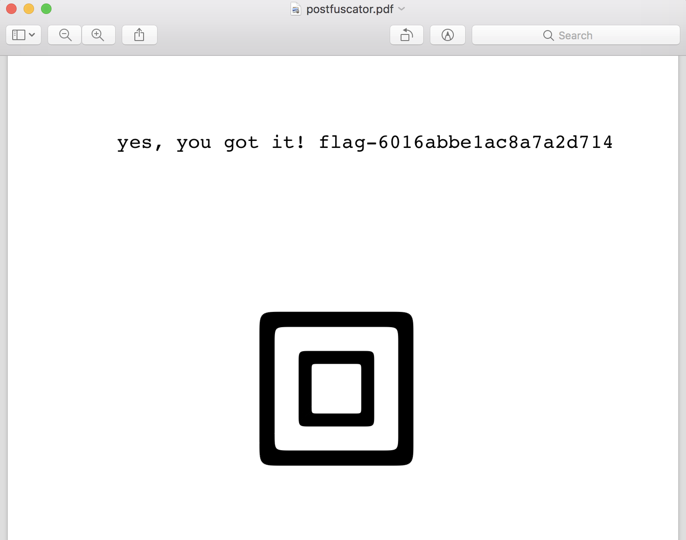

# C9: postfuscator

This problem provided a `sh` script which created a postscript (ps) file. The only input to this script was a "key" string, and if the correct key was input then it would be used as part of the flag and output in a ps file.

```ps
%!PS
/input 65 string def
/Courier
18 selectfont
currentfile input readline
%thekeystring
pop
/input exch store
/encrypt_str {
  /buf1 65 string def
  /buf2 (4L0ksa1t) def
  /n 0 def
  {
    buf2 n 8 mod get
    xor
    /i exch def
    buf1 n i put
    /n n 1 add store
  } forall
  buf1 0 n getinterval
} def
/test_str {
  /buf_z (800C46E31190C06039198D86E38180DC64311C0D868361C0D47230880C8730F198D06B0F1AC52192188C121C381B8C07039940D86D04898E06638190DC693484C4E092A8B0CA452C9F4961F34958DC6A389A40A691E1A8C643368AC4269010>) def
  /buf 118 string def
  /fake_file buf_z /ASCIIHexDecode filter def
  /fake_file2 fake_file /LZWDecode filter def
  fake_file2 buf readstring
  pop
  pop
  /ok 0 def
  /n 0 def
  {
    /c exch (...) cvs def
    buf n c length getinterval
    c
    eq {/ok ok c length add store} if
    /n n c length add store
  } forall
  ok buf length eq
} def
input encrypt_str test_str
{100 420 moveto (yes, you got it! flag-6016abbe1ac8a7a2d714) show}
{230 420 moveto (Sorry, nope.) show}
```

## Solution

Knowing nothing about the postscript language, I started out this challenge by googling around for a manual of commands along with any debugger which I could use. For a debugger I landed on ghostscript, which allowed me to test out my understanding of postscript commands and attempt to run the program line-by-line.

The script above breaks down relatively easily to the input section, the chunk which defines the `encrypt_str` string, and the chunk which defines the `test_str` string and tests it against something in the `encrypt_str`.

The debugging details of how I finally understood this script are somewhat difficult to explain, so instead, I'll just jump to the end which explains what each chunk of the file is doing.

First, the `encrypt_str` buffer is constructed by taking the input "key" string (which I forgot to mention should only contain lowerchase hexadecimal characters `0-9a-f`), prepending it with the literal `%` character, and XORing the resulting string with the literal string `4L0ksa1t`. Once this is done, the `encrypt_str` contains something like [17, 124, 1, 89, 64, 85, 4, 66, 3, 116, 9, 10, 17, 2, 85, 17, 82, ...] if you're using a key like `%0123456789abcdef...`

Next, the `test_str` chunk does two things. First, the `buf_z` string in the file is decoded to the `buf` value:

1712009367807218646859018292134521568805686127287089876612468382748236461208592688982686121828975882178245515674851882

This `buf` string is then used in the next loop:

```
  /ok 0 def
  /n 0 def
  {
    /c exch (...) cvs def
    buf n c length getinterval
    c
    eq {/ok ok c length add store} if
    /n n c length add store
  } forall
```

This loop was very confusing at first, but basically what happens here is, each byte of the `encrypt_str` buf is being popped off, read in as up to three `(...)` digits, and then compared (`eq`) to the next digits of `buf`. Once this passes, the next byte of `encrypt_str` is popped off and the same operation is executed.

What this means is that in order to solve the problem, we need to choose hexadecimal characters which once XORed with `4L0ksa1t` produce the digits in the `buf` string. To come up with the solution, I wrote a short script which performed this operation. One small wrinkle with this is that the length of the next character in the `buf` string is not exactly defined. So some trial-and-error must be used at each point of the "key" string extension. This required me to iteratively run the following python script to backtrack at certain points.

```python
buf2 = b'4L0ksa1t'
target = '1712009367807218646859018292134521568805686127287089876612468382748236461208592688982686121828975882178245515674851882'

arr = list(b'%406016abbe1ac8a7a2d7140232c58f68bc9932424e778c025b2893efa5d0edff')
t = target
for i,x in enumerate(arr):
	s = str(x^buf2[i%8])
	assert t.startswith(s)
	t = t[len(s):]

i = len(arr) % 8
while len(t) > 0:
	found = False
	next_chars = [(chr(x),x^buf2[i]) for x in b'0123456789abcdef']
	print(t, [(ch,s) for (ch,s) in next_chars if t.startswith(str(s))])
	for x in b'0123456789abcdef':
		s = str(x^buf2[i])
		if t.startswith(s):
			arr.append(x)
			print(bytes(arr),x,t)
			t = t[len(s):]
			found = True
			break

	if not found:
		print("no next character, need to backtrack!")
		sys.exit(0)
	i = (i + 1) % 8
```

Once completed, the correct "key" can be supplied to `postfuscator.sh` and the flag is output in the resulting postscript file:


