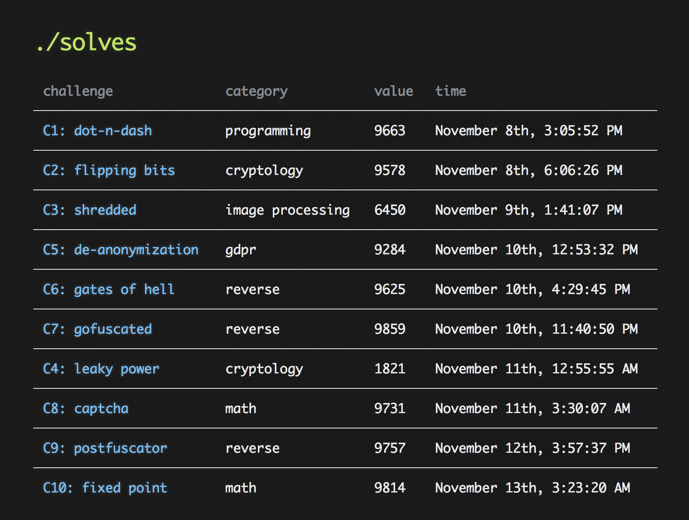

# SquareCTF 2018 Writeup

Enclosed is my writeup for the 2018 Square CTF (https://2018.squarectf.com/). Overall, the competition was a lot of fun. I worked on the entire CTF solo and was able to solve each of the ten problems. Had I spent more time immediately after each problem was released I might have placed higher, but as-is I managed > 9000 points on eight of the ten problems. My general strategy was to rely on custom solutions, and only in a couple cases did I resort to using a custom library to solve each challenge. As I write this, I'm sitting in 5th place with a day of the competition to go. I'll likely slip down as more solvers of the last few problems come in, but overall it was a good time.

## Scoring

[SquareCTF Team 'ion'](https://2018.squarectf.com/team/807)

## Problems

- [C1: dot-and-dash](./C1.md): A simple bit manipulation programming exercise
- [C2: flipping bits](./C2.md): A common modulus attack on RSA
- [C3: shredded](./C3.md): Reconstruct the strips of a QR code
- [C4: leaky power](./C4.md): Recover an AES key from a power side-channel attack (Correlation Power Analysis)
- [C5: de-anonymization](./C5.md): Iteratively combine datasets and issue web requests
- [C6: gates of hell](./C6.md): x86 reverse engineering
- [C7: gofuscated](./C7.md): De-obfuscate a golang program
- [C8: captcha](./C8.md): Parse a font included with a HTML page to create and solve an equation
- [C9: postfuscator](./C9.md): Reverse engineer a postscript program
- [C10: fixed point](./C10.md): Derive a language & pattern to construct a specific string

## Easter Eggs

The "gates of hell" flag `flag-526f64696e0000666` is ASCII for Rodin (who created a "gates of hell" sculpture) and 666 ("the number of the beast", also included in the challenge).

